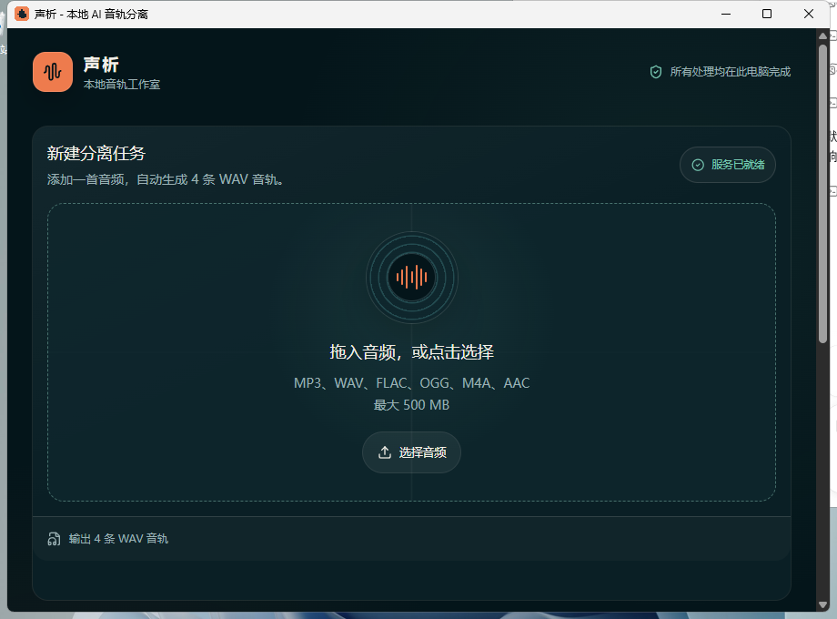

# 声析 (vocal-separator)

[English](README.md)

本地 AI 音轨分离桌面软件：拖入一首（或多首）歌，在本机用 [Demucs](https://github.com/adefossez/demucs) 拆成 **人声 / 鼓组 / 贝斯 / 其他** 四条 WAV 音轨，或直接得到 **人声 + 伴奏** 两轨。音频全程不出本机，无上传云盘环节、无账号、无排队。



## 功能特性

- **两种音轨预设**：`四条音轨`（人声 / 鼓组 / 贝斯 / 其他）或 `人声 + 伴奏`（Demucs `--two-stems`），每轨一个 WAV
- **批量队列**：一次拖多首，按顺序一首一首跑（一个 Demucs 任务独占显卡），每行显示上传百分比、阶段、已用时间与预计剩余
- **卡住也取消得掉**：排队中与进行中的任务都能取消。读子进程输出放在守护线程里，主循环每 0.5 秒醒一次看取消标记与墙钟（`VOCAL_SEPARATOR_CHILD_POLL`），到点走 terminate → 等一下 → kill，并把显卡槽位还回去（`VOCAL_SEPARATOR_JOB_TIMEOUT`，默认 30 分钟）；只赖着不退出也会被同一套序列收掉
- **本机环境看得见**：界面顶部那条是实测值——python / torch / CUDA 设备名 / Demucs / ffmpeg 版本与路径，以及 `htdemucs` 权重是否已缓存
- **失败给出路**：没装 Demucs、缺 ffmpeg、显存不够、结果过期，都各自给出下一步该做什么，而不是一串报错
- **最近结果**：持久索引 `backend/history.json` 记录历次分离的真实文件与字节数；重复拖入同一个文件会先问"这首已经分离过，还要再来一遍吗"
- **导出可控**：可先试听；桌面版「保存」弹系统另存为（目录与文件名你定），浏览器模式走下载；结果目录会显示出来并可一键打开
- **常见格式**：MP3 / WAV / FLAC / OGG / M4A / AAC，外加 MP4 / MOV / MKV / WebM / AVI（先用 FFmpeg 提取音频），单文件最大 500 MB
- **队列经得起重启**：任务表原子写进 `backend/queue.json`，开机读回来 —— 还在排队且输入文件完好的重新排队；跑到一半被打断的如实标成「服务重启，未跑完」，**绝不冒充成功**，也不会悄悄进 history.json；`GET /api/health` 的 `data.recovery` 把"恢复了几条、收走了哪些半成品"摊开写清
- **自动清理**：崩溃留下的半成品输出目录在开机就被回收（并出报告），其余上传与输出文件 1 小时后自动删除；已另存到别处的文件不受影响
- **Agent API / MCP**：同一个服务对本机 Agent 暴露 `vocal.*` 工具，只听 `127.0.0.1:8000`

## 技术栈

- **前端**：Next.js 16 + React 19 + Tailwind CSS，Electron 桌面壳（自绘标题栏 + 另存为 IPC）
- **后端**：Python FastAPI + Demucs 4（GPU 走 torch cu124，无 GPU 自动退回 CPU）

## 运行

前置要求：Node.js ≥ 20.9（Next.js 16）、Python 3.10+。首次分离会一次性下载 `htdemucs` 权重（约 80 MB）到 torch / Hugging Face 缓存目录。

```powershell
npm install
python -m pip install -r backend/requirements.txt
```

随后双击 `start.bat`，或分别启动前后端：

```powershell
python backend/main.py   # 后端 http://127.0.0.1:8000
npm run dev              # 前端 http://localhost:3000
```

浏览器访问 `http://localhost:3000`。桌面模式：`npm run desktop`（先构建 `out/`，Electron 自己起后端并托管页面）。

## 配置

| 变量 | 作用 |
| --- | --- |
| `NEXT_PUBLIC_API_BASE_URL` | 前端指向别的后端地址 |
| `VOCAL_SEPARATOR_ORIGINS` | 后端允许的前端来源（CORS 与闸门共用这一份名单），英文逗号分隔 |
| `VOCAL_SEPARATOR_TOKEN` | 共享令牌：设了之后所有非 GET 请求必须带 `x-vocal-token` |
| `VOCAL_SEPARATOR_DATA_DIR` | 上传 / 输出 / history 存放目录（桌面版用自己的 userData） |
| `VOCAL_SEPARATOR_PORT` | 后端端口，默认 `8000` |
| `VOCAL_SEPARATOR_PYTHON` | 桌面壳用哪个 Python 起后端 |
| `VOCAL_SEPARATOR_FFMPEG` | 指定 ffmpeg 路径 |
| `VOCAL_SEPARATOR_JOB_TIMEOUT` | 单个任务最多占显卡多少秒（默认 1800） |
| `VOCAL_SEPARATOR_QUEUE_TIMEOUT` | 排队最久等多久就放弃（默认 3600） |
| `VOCAL_SEPARATOR_CHILD_POLL` | 子进程不出声时，隔多少秒查一次取消与墙钟（默认 0.5） |

## 检查

```powershell
npm run verify      # 类型检查 + 后端单测 + 窗口控件测试 + 桌面壳闸门测试
npm run lint
npm run build
python -m unittest discover -s backend -v   # 或 npm run test:backend
npm run test:guard                          # 桌面壳 -> 后端这条第一方路径，端到端真跑
```

## 只有本机能用 —— 具体到判据

服务只听 `127.0.0.1`；在此之上每个请求还要过一道闸门（`backend/local_guard.py`，
在 `backend/main.py` 里以中间件挂载，所以路由想漏也漏不掉）：

1. **Host 钉死**：只接受 `127.0.0.1:端口` / `localhost:端口` / `[::1]:端口`，其余 JSON `403 host_forbidden`。
   这一条挡的是 DNS rebinding —— 攻击者域名解析到本机时，Host 仍然是那个域名。
   判据**从不**拿 `Origin` 去比本次请求自己的 `Host`：rebinding 成立时两者恰好一致，那正是漏法。
2. **Origin / Referer 白名单**：带了就必须是第一方 —— 回环来源（端口任意，桌面壳的渲染服务每次端口都不同）
   或 `VOCAL_SEPARATOR_ORIGINS` 里登记的来源。跨站的 `multipart/form-data` 表单 POST 不需要预检、
   也不需要 CORS 允许就能打到业务代码，现在它在排队之前、在写第一个字节之前就被
   `403 origin_forbidden` 拒掉。不带 Origin/Referer 的是非浏览器调用（curl、MCP 桥、存活探针），放行。
3. **非 GET 要共享令牌**：配置了令牌时，所有写操作必须带 `x-vocal-token`（或 `Authorization: Bearer`），
   用 `hmac.compare_digest` 定长时间比较。没带 → `401 token_required`，带错 → `403 token_mismatch`；
   读操作（`GET`/`HEAD`/`OPTIONS`）永远不需要。状态变更路由永远不会出现 `Access-Control-Allow-Origin: *`。

**令牌发现方式（桌面壳具体做什么）**：解析顺序是 `VOCAL_SEPARATOR_TOKEN`
→ `<VOCAL_SEPARATOR_DATA_DIR>/security.json`（内容 `{"token": "…"}`）→ 未配置。
`GET /api/health` 的 `data.guard` 会说出 `token_required`、`token_header`、`token_source`
和 `token_file` 的绝对路径 —— 只有路径，永远没有令牌本体 —— 所以任何本机第一方进程都知道该去哪读。
`GET /api/session-token` 只把令牌发给第一方页面（回环来源，响应 `Cache-Control: no-store`），浏览器界面用的就是它；
`agent/mcp-server.mjs` 读 `data.guard.token_file`；`electron/main.cjs`（经 `electron/api-proxy.cjs`）
在自己起后端时生成令牌、写进 `security.json`、用 `VOCAL_SEPARATOR_TOKEN` 交给子进程，
并在 `/api/*` 转发时补上请求头。若它附加到一个"要求令牌却读不到"的后端，就在启动时说清原因失败，
而不是留下一个点哪都 401 的界面。

没配置令牌时，第 1、2 层照旧生效 —— 这是 `personal-agent-hub/docs/AGENT_API_STANDARD.md`
里"配置了就要求共享令牌"的原样实现：`python backend/main.py`（agent hub 与 start.bat 起的就是它）
不改任何调用方就能继续用。

## Agent API / MCP

后端本来就是常驻服务（界面和桌面壳都连它），所以个人 Agent 服务的契约端点**直接挂在同一个端口上**，不多开监听、不多开一份任务表：

```
GET  http://127.0.0.1:8000/api/health          # 旧键 + 标准 {ok,data} 信封同时给
GET  http://127.0.0.1:8000/api/agent/tools
GET  http://127.0.0.1:8000/api/agent/manifest
POST http://127.0.0.1:8000/api/agent/tool      # {"tool":"vocal.…","input":{…}}
```

7 个工具，全部走界面用的同一批函数，版本号、路径、字节数都是本机实测：

| 工具 | risk | 作用 |
| --- | --- | --- |
| `vocal.env_probe` | read | python / torch / CUDA 设备名 / demucs / ffmpeg 版本与路径、权重是否已缓存（含文件与 MB）、数据目录、在跑任务数 |
| `vocal.mode_list` | read | 预设、轨名、底层 Demucs 参数、接受格式、大小上限、保留时长 |
| `vocal.separate_submit` | exec | 对**磁盘上已有的文件**启动真实分离（必须 `confirm:true`），返回 job_id、输出目录、阶段；`wait:true` 阻塞到结束 |
| `vocal.job_status` | read | 状态 / 进度 / 阶段 / 已用 / 预计剩余 / 排队位次，以及每条轨的真实路径、字节数与是否还在 |
| `vocal.job_wait` | read | 轮询到终态或超时 |
| `vocal.job_cancel` | write | 取消排队或进行中的任务（终止子进程、清理目录） |
| `vocal.output_list` | read | 历史结果与每条轨的字节数；带 `name`+`bytes` 就是在问"这首歌分离过没有" |

```powershell
npm run agent:serve    # python agent/server.py：报地址，没起就把后端带起来
npm run agent:mcp      # node agent/mcp-server.mjs：给任何 MCP 客户端用的 stdio 桥
```

细节、curl 示例与本机验证记录见 [`agent/README.md`](agent/README.md)。

## 桌面打包

```powershell
npm run desktop:pack   # 产出 release/ 下的 Windows 便携版 exe（release/ 不入库）
```

## 项目结构

```
src/                  前端页面与组件（Next.js App Router）
electron/             Electron 主进程与 preload（自绘标题栏、另存为、后端托管）
backend/              FastAPI 服务（main.py）、契约层（agent_api.py）、单测（test_main.py）
agent/                tools.py（项目自己写的）+ errors.py / mcp-server.mjs / server.py（标准模板）
scripts/              start.bat 用的 wait-for-services.ps1
desktop-assets/       应用图标
docs/                 README 截图
```

处理链路：界面 → `POST /api/separate`（multipart + preset）→ 需要时用 FFmpeg 解码 → `python -m demucs [--two-stems vocals]` 子进程 → WAV 落在 `outputs/<job_id>/stems`，由 `GET /api/download/{job_id}/{stem}` 提供。进度与阶段来自 `GET /api/jobs/{job_id}`，完成的任务追加进 `backend/history.json` 并由 `GET /api/history` 列出。同一时刻只跑一个分离（`SEPARATION_SLOTS`），后来的任务停在 `queued` 并给出排队位次。

## 许可证

[MIT](LICENSE)
